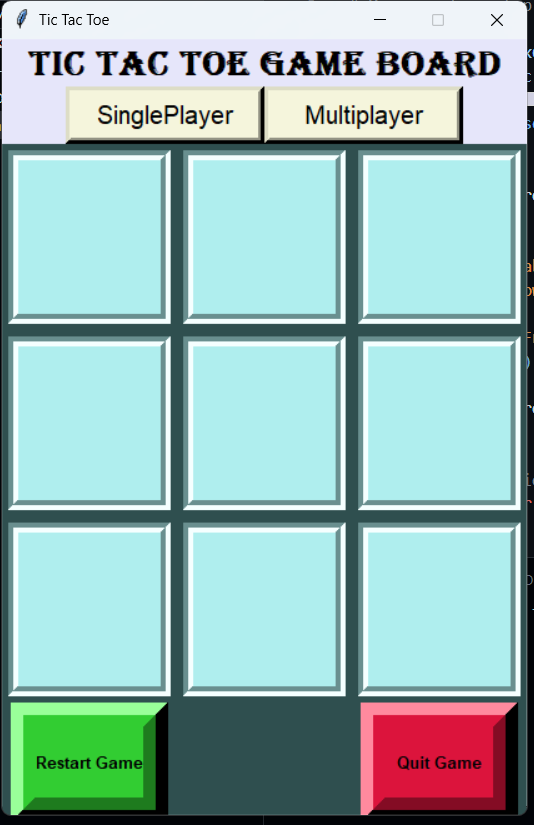
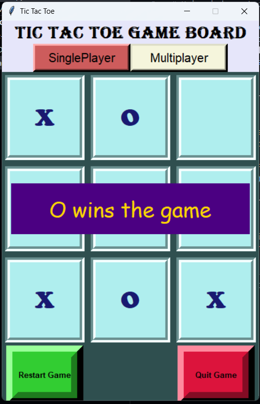

# Tic Tac Toe Game 🎮

A simple **Tic Tac Toe game built using Python and Tkinter**.  
The game supports both **Single Player (AI)** and **Multiplayer** modes with a clean GUI.

---

## Features ✨

- 🧑‍🤝‍🧑 **Multiplayer mode** (2 players on the same system)
- 🤖 **Single Player mode** with computer AI (Minimax algorithm)
- 🎨 Graphical User Interface using **Tkinter**
- 🔄 Restart game option
- ❌⭕ Clear win/draw detection

---

## Technologies Used 🛠️

- **Python**
- **Tkinter** (for GUI)
- **Minimax Algorithm** (for AI decision-making)

---
## Screenshots 📸

### Game Board


### Winning State


## How to Run the Project ▶️

1. Make sure Python is installed  
   Check using:
   ```bash
   python --version
